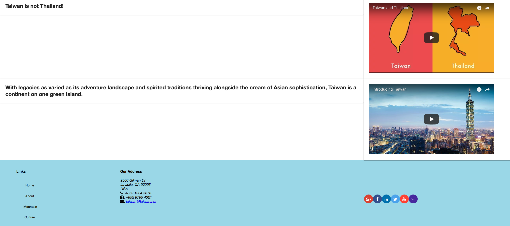

# Taiwan

This project was generated with [Angular CLI](https://github.com/angular/angular-cli) version 6.1.1.
- ng new taiwan --style=scss
- npm install @angular/material@6.2.1 --save
- npm install @angular/cdk@6.2.1 --save
- npm install --save @angular/animations@6.0.6
- npm install --save hammerjs@2.0.8
- npm install --save @angular/flex-layout@6.0.0-beta.16
- ng generate component header
- npm install font-awesome@4.7.0 --save
- npm install --save ngx-restangular@3.0.0

## Development server

Run `ng serve` for a dev server. Navigate to `http://localhost:4200/`. The app will automatically reload if you change any of the source files.

## Code scaffolding

Run `ng generate component component-name` to generate a new component. You can also use `ng generate directive|pipe|service|class|guard|interface|enum|module`.

## Build

Run `ng build` to build the project. The build artifacts will be stored in the `dist/` directory. Use the `--prod` flag for a production build.

## DEMO
### About

